# HX-ASWF-Infrastructure

> **One repository turns autonomous agent teams into a governed, evidence-backed production machine.**
> The Agentic Software Factory (ASWF) builds itself first, then builds products.

<p align="center">
  
</p>

The factory is a machine that takes an input and produces a product. Its first product is itself (KDD-010), so the git history shows the machine building itself.

---

## Install

```bash
npm install              # typescript, tsx, vitest
npm run install:factory  # generates AGENTS.md and verifies the path guard
npm test                 # runs the control-plane tests, including the real guard
```

That is the entire setup. The control plane is TypeScript run through `tsx`. No build step, no config beyond `tsconfig.json`.

---

## Why this exists

<p align="center">
  
</p>

Vibe coding is fast until it is not. A generalist agent that is not grounded on the technology it touches writes generic, unverifiable output. The previous project failed for two reasons: the process to construct the repository did not work, and the structure did not look professional.

This factory fixes both. Two classes of agents, grounded and governed:

| Class | What it does | Where it lives |
|---|---|---|
| **Technology experts** | One per technology, grounded on its source. The build class. | The library, listed in `roster.yaml` |
| **Cross-cutting roles** | Coordinator, validator, reviewers, doc-writer. The process class. | `prompts/roles/` |

The rule that keeps the fleet linear: reviewers stay cross-cutting, never per-technology.

---

## Knowledge is foundational

<p align="center">
  
</p>

An agent's understanding of context is as critical as the code it writes. Knowledge is infrastructure: it lives in source control, travels with every agent, and improves over time.

Two tiers, one pointer:

- `knowledge/` — in-repo, git-versioned, small, curated. Rules, conventions, ADRs, precedents, runbooks.
- The Technology Knowledge Vault — local disk, not in git, large. The per-technology library.

Every agent reads the knowledge layer at the gate before it executes. No knowledge review, no execution.

---

## The pipeline

<p align="center">
  
</p>

Work enters one way: spec → change → deploy. Three human checkpoints sit where a wrong assumption is cheapest to fix. On every change, deterministic gates run: the path guard, typecheck and tests, then independent validation (Tessa). A simple commit completes end to end, with no process failure.

See `GOVERNANCE.md` and `CONTRIBUTING.md`.

---

## Folder structure

```
HX-ASWF-Infrastructure/
├── README.md                  # this file
├── LICENSE                    # MIT
├── AGENTS.md                  # generated rules file — do not hand-edit
├── .factory.yaml              # the repo's own manifest — hand-edited source
├── roster.yaml                # the agent registry (two classes)
├── knowledge/                 # in-repo knowledge, tier 1
│   ├── rules/                 # global rules → source of AGENTS.md
│   ├── conventions/           # commit message convention
│   ├── adr/                   # architecture decision records
│   ├── precedents/            # validated patterns to reuse or avoid
│   ├── runbooks/              # operational procedures
│   └── vaults.yaml            # tier 2 pointer to the Technology Knowledge Vault
├── specs/                     # the specification store
├── prompts/
│   ├── roles/                 # cross-cutting roles (Xavier, Tessa, Ward, Pace, Quill)
│   └── skills/                # orchestrator skills (spike, quick-fix, feature-factory)
├── profiles/                  # per-stack rule packs
├── src/                       # TypeScript control plane (factory install)
├── governance/                # stages, policy, path guard, templates
├── test/                      # control-plane tests (vitest)
├── evals/                     # per-agent evaluation cases
├── evidence/                  # retained run evidence — append-only, git-ignored
├── observability/             # DORA and cost metric definitions
├── docs/book/                 # the book — human-facing design reasoning
├── examples/                  # sample manifests and workspace files
└── images/                    # the animated diagrams above
```

---

## Make it your own

This structure is a starting point, not a finished product. Add a technology expert by adding its folder to the library and its entry to `roster.yaml`. Add a rule by editing `knowledge/rules/global.md` and re-running `npm run install:factory`. Add a stack by adding a profile. Each axis of change touches exactly one place.

---

## Where it can still fail

- **The path guard is a guardrail, not a sandbox.** It blocks Write and Edit, not Bash. Stage 3 sandboxing closes that gap later.
- **DeepSeek Harness is a developer preview.** Version 0.1.1-rc.2, breaking changes expected. Pin a version and keep the adapter boundary so a harness swap stays cheap.
- **Knowledge rot.** A technology pack pointed at a repo goes stale unless re-ground each run. Re-grounding is part of activation.
- **Self-validation is the persistent risk.** The design separates roles, but separation is only as real as the discipline of the people and agents running it.

---

## License

MIT — see [`LICENSE`](LICENSE).
